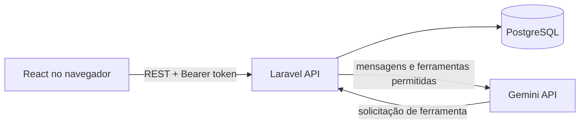
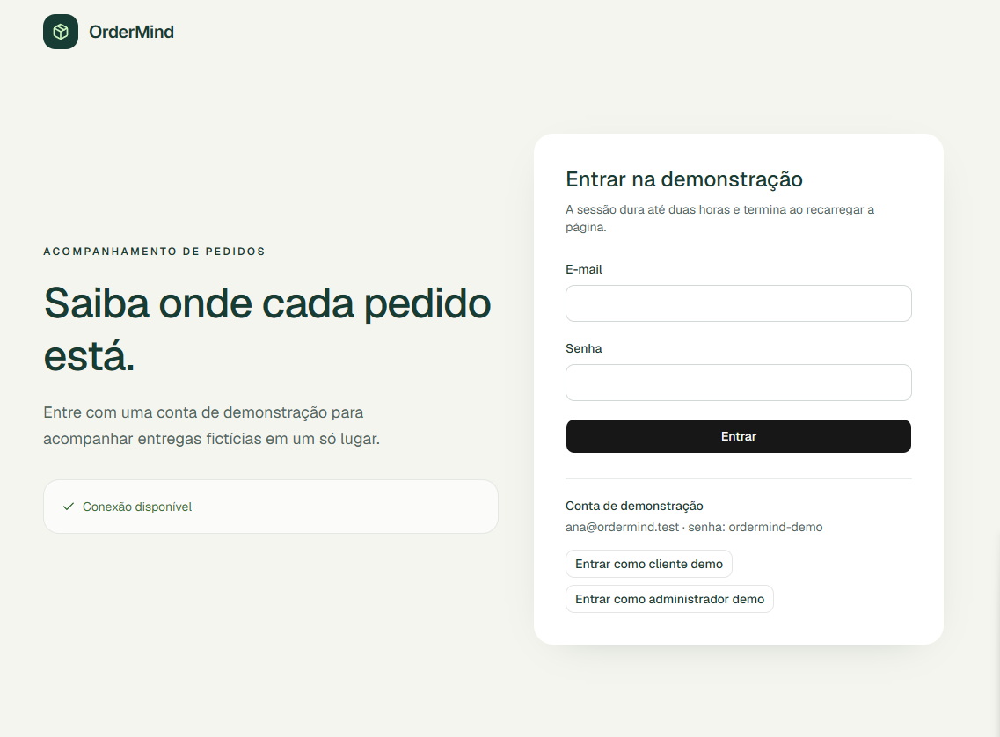
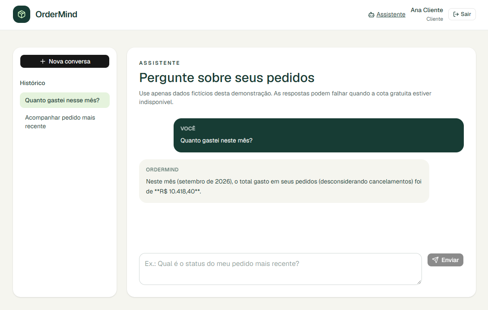

# OrderMind

OrderMind é uma aplicação demonstrativa de acompanhamento de pedidos. Clientes podem consultar pedidos, entregas e gastos; administradores gerenciam pedidos e eventos de rastreamento; e o assistente de IA responde a perguntas sobre dados fictícios da conta autenticada.

O projeto foi pensado para execução local e apresentação pelo código no GitHub. Não há ambiente de produção configurado.

## Stack

- **Frontend:** React 19, TypeScript, Vite, React Router, TanStack Query, Tailwind CSS e shadcn/ui.
- **Backend:** Laravel 13, PHP 8.4, Laravel Sanctum e PostgreSQL 17.
- **Qualidade:** Pest, Laravel Pint, Vitest, React Testing Library, ESLint, Prettier e Playwright.
- **Infraestrutura local:** Docker Compose, com serviços para frontend, API, banco de dados e worker de filas.
- **IA:** Google Gemini API, usando `gemini-3.7-flash` no Free Tier.

## Arquitetura



O frontend consome uma API REST. O Laravel concentra autenticação, validação, autorização e regras de negócio. Cada consulta de cliente é limitada ao usuário autenticado por Policies e queries escopadas.

O Gemini nunca acessa o banco diretamente. Quando precisa de dados, ele solicita uma ferramenta autorizada ao backend, como consultar o pedido mais recente, detalhar um pedido, listar atrasos, calcular gasto mensal ou verificar possibilidade de cancelamento. As ferramentas executam no contexto do usuário autenticado e geram logs visíveis apenas ao administrador.

Principais diretórios:

- `frontend/src/`: interface React, rotas, componentes e cliente HTTP.
- `backend/app/`: controllers, requests, resources, policies, actions, serviços e ferramentas de IA.
- `backend/database/`: migrations, factories e seeders de demonstração.
- `backend/routes/`: rotas REST da API.
- `backend/tests/` e `frontend/e2e/`: testes de backend e ponta a ponta.
- `scripts/`: preparo do ambiente e execução isolada dos testes backend.

## Telas

| Login | Dashboard do cliente |
| --- | --- |
|  |  |

### Assistente de pedidos



## Como executar

### Requisitos

Instale Git, Docker Engine, Docker Compose v2 e Bash. Não é necessário instalar PHP, Composer, Node.js ou npm na máquina: eles são executados nos contêineres.

```bash
git clone https://github.com/italo-vinicius/order-mind.git
cd order-mind
bash scripts/setup.sh
```

O script cria os arquivos `.env` locais quando necessários, instala dependências, gera a chave do Laravel, aplica migrations e inicia os serviços. Na primeira execução, o Docker baixa as imagens e isso pode levar alguns minutos.

Depois, carregue os dados fictícios:

```bash
docker compose exec backend php artisan db:seed --force
```

Acesse:

- Aplicação: [http://localhost:5173](http://localhost:5173)
- Health check da API: [http://localhost:8000/api/health](http://localhost:8000/api/health)
- PostgreSQL local: `127.0.0.1:5432` (para Beekeeper ou ferramenta equivalente)

Contas de demonstração:

| Perfil | E-mail | Senha |
| --- | --- | --- |
| Cliente | `ana@ordermind.test` | `ordermind-demo` |
| Administrador | `admin@ordermind.test` | `ordermind-demo` |

O token de sessão fica somente na memória do navegador, expira em duas horas e exige novo login ao recarregar a página.

## Configuração do Gemini

1. Crie uma chave no [Google AI Studio](https://aistudio.google.com/app/apikey).
2. Abra o arquivo local `backend/.env`.
3. Preencha a chave e mantenha o modelo configurado:

```dotenv
GEMINI_API_KEY=sua_chave_aqui
GEMINI_MODEL=gemini-3.7-flash
```

4. Reinicie a API para aplicar a alteração:

```bash
docker compose restart backend
```

Sem `GEMINI_API_KEY`, o restante da aplicação continua disponível e o chat informa que o assistente está indisponível. A chave é lida somente pelo backend: nunca use o prefixo `VITE_`, não a envie em mensagens e não versione arquivos `.env`. A demonstração usa apenas dados fictícios; ainda assim, o Free Tier do Gemini pode usar conteúdo enviado para melhoria do produto.

## Comandos úteis

| Comando | Finalidade |
| --- | --- |
| `docker compose up -d --wait` | Inicia os serviços já preparados. |
| `docker compose down` | Para os serviços e preserva os dados do banco. |
| `docker compose ps` | Mostra estado e portas dos contêineres. |
| `docker compose logs -f backend queue frontend` | Acompanha logs da API, fila e interface. |
| `docker compose restart backend` | Reinicia a API após alterar `backend/.env`. |
| `docker compose exec backend php artisan migrate` | Aplica migrations pendentes. |
| `docker compose exec backend php artisan db:seed --force` | Cria ou atualiza os dados fictícios. |
| `docker compose exec backend php artisan queue:restart` | Recarrega o worker após alterações de código. |

## Testes e qualidade

Execute os comandos na raiz do repositório:

```bash
docker compose run --rm --no-deps backend vendor/bin/pint --test
bash scripts/test-backend.sh
npm --prefix frontend run format:check
npm --prefix frontend run lint
npm --prefix frontend run typecheck
npm --prefix frontend run test
PLAYWRIGHT_BROWSERS_PATH=/tmp/ordermind-playwright npm --prefix frontend run test:e2e
```

O script de backend usa o serviço isolado `database-test` e recria somente esse banco. Os dados do PostgreSQL de desenvolvimento não são alterados. Na primeira execução do Playwright, instale o Chromium com:

```bash
PLAYWRIGHT_BROWSERS_PATH=/tmp/ordermind-playwright npx --prefix frontend playwright install chromium
```

## Regras de negócio e limites

Valores são exibidos em BRL com duas casas decimais. Datas são persistidas em UTC e apresentadas no fuso `America/Sao_Paulo`. O gasto mensal considera `placed_at` e ignora pedidos cancelados. Um pedido está atrasado quando a previsão venceu e ele não foi entregue nem cancelado. Cancelamentos são permitidos apenas em `pending_payment` e `processing`, até `cancellable_until` inclusive.

Transportadoras, rastreamento, usuários e pedidos são simulados. O escopo não inclui pagamentos, cadastro público, recuperação de senha, transportadoras reais, WebSockets, aplicativo móvel ou deploy.

## Segurança

Não versione arquivos `.env` nem credenciais. Mantenha chaves Gemini e banco de dados no backend. O banco local exposto em `127.0.0.1:5432` usa credenciais públicas de desenvolvimento e não deve ser reutilizado fora deste ambiente.
