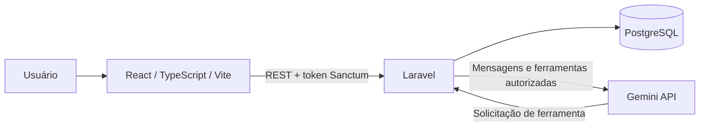

# OrderMind — Arquitetura e decisões da fase 01

## Estado do documento

Decisões consolidadas em 26/09/2026. Filas, sessão e regras de negócio aprovadas pelo usuário; remoto configurado e consultado com sucesso. Nenhum serviço externo foi provisionado e nenhuma dependência da aplicação foi instalada. A instalação da stack e sua validação integrada pertencem à fase 02.

## Arquitetura prevista

Laravel concentra autenticação, Policies, validação e regras de negócio. O Gemini não acessa o banco: solicita ferramentas cadastradas que executam no contexto do usuário autenticado. O MVP usa dados fictícios e transportadoras simuladas.

### Organização do monorepo

| Caminho planejado | Responsabilidade |
| --- | --- |
| `frontend/src/` | Páginas, componentes, rotas, serviços HTTP e hooks |
| `frontend/public/` | Assets estáticos |
| `backend/app/Http/` | Controllers, Form Requests e API Resources |
| `backend/app/Policies/` | Autorização de pedidos, conversas e administração |
| `backend/app/Actions/` | Cancelamento e atualização de status |
| `backend/app/AI/` | Assistente, registro e ferramentas de consulta |
| `backend/app/Jobs/` | Geração de títulos de conversas |
| `backend/app/Services/Tracking/` | Contrato e provedores simulados |
| `backend/database/` | Migrations, factories e seeders |
| `backend/tests/` | Testes de integração e domínio |
| `docs/` | Arquitetura, acompanhamento e screenshots |

Esses diretórios de aplicação serão criados na fase 02 ou na fase da funcionalidade correspondente.

## Inventário verificado

| Ferramenta | Versão observada | Verificação |
| --- | --- | --- |
| Git | 2.34.1 | Repositório inicializado em `main`, ainda sem commits |
| Docker CLI | 29.8.1 | Executável disponível |
| Docker Engine | 29.4.0 | Daemon respondeu a `docker info` após autorização de acesso ao socket |
| Docker Compose | 5.1.2 | Plugin disponível |
| Node.js | 22.13.0 | Disponível via nvm |
| npm | 10.9.2 | Disponível |
| PHP no host | 8.2.33 | Não atende ao mínimo do Laravel 13 |
| Composer no host | 2.8.4 | Disponível; não usar o PHP do host para resolver dependências de PHP 8.4 |
| Arquitetura da máquina | x86_64 | Verificada com `uname -m` |

Identidade Git já configurada. Remoto `origin`: `https://github.com/italo-vinicius/order-mind.git`, informado pelo usuário e configurado com autorização. `git ls-remote origin` terminou com código 0 e sem referências: remoto acessível e vazio nesta consulta. Nenhum push executado.

## Compatibilidade e execução definidas

- **Backend:** Laravel 13 (`^13.0`) com PHP 8.4.26 e Composer 2.10.3 em contêineres. Laravel 13 requer PHP ≥ 8.3; a documentação atual do Pest requer PHP ≥ 8.4. PHP 8.4 atende aos dois requisitos e evita alterar o PHP instalado no host. [Laravel](https://laravel.com/docs/13.x/releases), [Pest](https://pestphp.com/docs/installation).
- **Frontend:** usar Node.js 22.23.3 com npm 10.9.9 na stack do projeto, conforme o [arquivo oficial da versão](https://nodejs.org/en/download/archive/v22.23.3). A instalação observada atende ao mínimo publicado do Vite, mas não foi validada com as dependências do projeto. [Vite](https://vite.dev/guide/), [ciclo do Node.js](https://nodejs.org/en/about/previous-releases).
- **Banco:** PostgreSQL 17.11 local, conforme a [política oficial de versões](https://www.postgresql.org/support/versioning/), e major 17 no Neon, que gerencia atualizações de patch. Confirmar a opção no provisionamento. [Neon](https://neon.com/blog/postgres-17).
- **Qualidade:** Pest, Vitest com React Testing Library e Playwright, conforme o plano; Laravel Pint, ESLint e Prettier para padronização. A resolução exata das versões será verificada antes de instalar, sem misturar instruções de versões de desenvolvimento com estáveis. [Vitest](https://vitest.dev/guide/migration.html), [Playwright](https://playwright.dev/docs/intro).
- **Reprodutibilidade:** os patches acima são a referência inicial, consultada em 26/09/2026. PHP confirmado na [página de downloads](https://www.php.net/downloads.php), Composer na [página oficial](https://getcomposer.org/download/). Na fase 02, validar disponibilidade das imagens e fixar tags/digests, além de gerar `composer.lock` e `package-lock.json` com versões exatas das bibliotecas. Não usar `latest` como configuração permanente. Compatibilidade documental não equivale a build/testes executados; qualquer incompatibilidade deverá ser resolvida e registrada antes do scaffold.

## Contratos para implementação

Sessão e regras de negócio foram aprovadas via Ask Question em 26/09/2026. Os contratos HTTP abaixo completam os fluxos já previstos no MVP.

### API

- Prefixo `/api`, JSON, chaves em `snake_case`, IDs internos numéricos e número do pedido separado para exibição/busca.
- Resources com envelope `data`; listas paginadas com `data`, `links` e `meta`.
- Paginação: 15 itens por padrão, máximo de 100; filtros e ordenação limitados a campos permitidos.
- Erros com `message`; validação com `errors` por campo. Usar 401 para ausência de autenticação, 403 para ação proibida, 404 para recurso não visível, 422 para entrada inválida e 429 para limite excedido.
- Adicionar `POST /api/conversations` com criação no contexto autenticado e resposta 201; listar em `GET /api/conversations`, consultar detalhes em `GET /api/conversations/{conversation}` e enviar mensagens em `POST /api/conversations/{conversation}/messages`.
- Nunca aceitar `user_id` enviado pelo frontend ou pela IA como autoridade para consultas de cliente.

### Sessão — aprovada em 26/09/2026

Escolha explícita do usuário: token Sanctum apenas em memória, expiração em duas horas, revogação no logout e novo login ao recarregar a página. Limpar caches no logout ou mudança de usuário. Não persistir token em `localStorage` ou `sessionStorage` sem nova decisão explícita.

A autenticação SPA por cookie do Sanctum exige domínio raiz compartilhado. Usar cookie/proxy com os domínios distintos previstos demanda uma decisão de arquitetura; não será adotado automaticamente. [Sanctum](https://laravel.com/docs/13.x/sanctum).

### Regras de negócio — aprovadas em 26/09/2026

- Moeda única BRL; valores no banco como `numeric(12,2)` e na API como strings decimais, evitando cálculos monetários com ponto flutuante.
- Timestamps armazenados em UTC e enviados em ISO 8601; exibição e intervalo mensal em `America/Sao_Paulo`.
- Gasto mensal pelo campo `placed_at`, excluindo pedidos cancelados, com intervalo entre início do mês inclusivo e início do mês seguinte exclusivo.
- Atraso: estimativa vencida e pedido não entregue/cancelado. Esse predicado rege indicadores e consultas de atrasados; o status explícito `delayed` continua representando o estado operacional registrado. A consulta não altera o status persistido.
- Cancelamento: somente `pending_payment` ou `processing`, com instante atual menor ou igual a `cancellable_until`. A matriz completa das demais transições será documentada na fase 04; não introduzir exceções sem consulta.

## Hospedagem e orçamento

Orçamento autorizado para novas despesas: **zero**. Não habilitar faturamento, upgrade automático ou recursos pagos. Nenhuma conta ou quota individual foi verificada nesta etapa.

| Serviço previsto | Evidência pública e consequência |
| --- | --- |
| Vercel Hobby | Destinado a projetos pessoais não comerciais; adequado ao objetivo de portfólio, sujeito às quotas. [Documentação](https://vercel.com/docs/plans/hobby) |
| Render Free Web Service | Suspende após 15 minutos sem tráfego; filesystem efêmero, sem worker separado gratuito ou shell/one-off jobs gratuitos. Há limites de horas e tráfego; revisar comportamento de cobrança antes de provisionar. Persistir dados no PostgreSQL externo e planejar migrations sem depender de shell. [Documentação](https://render.com/docs/free) |
| Neon Free | Fonte oficial no GitHub informa 100 CU-h por projeto/mês, 0,5 GB por projeto e 5 GB de transferência pública por projeto/mês. Página principal indisponível nesta consulta; reconfirmar no painel antes do deploy. [Fonte oficial](https://github.com/neondatabase/website/blob/main/content/faqs/free-plan-limits-and-quotas.md) |
| Gemini | Gratuidade e quotas dependem do modelo e da conta. Selecionar um modelo de texto com function calling elegível para Free Tier, sem fallback pago; fixar em `GEMINI_MODEL` antes da integração. A tabela pública informa uso de conteúdo para melhoria de produtos no Free Tier: usar somente dados fictícios e exibir aviso no chat. [Preços e condições por modelo](https://ai.google.dev/gemini-api/docs/pricing) |

### Filas — aprovadas em 26/09/2026

O plano prevê `GenerateConversationTitleJob`. Um worker separado no Render não tem modalidade gratuita. O usuário aprovou fila no desenvolvimento e execução síncrona do título em produção, com timeout e título de fallback; preserva a funcionalidade, mas pode aumentar a latência. Limitar a geração ao primeiro título da conversa e preservar a resposta do chat se a geração falhar. Não contratar worker ou ativar fallback pago.

## Registro de decisões

| ID | Questão | Estado |
| --- | --- | --- |
| D01 | Filas locais e título síncrono em produção com timeout/fallback | Aprovado via Ask Question em 26/09/2026; custo zero |
| D02 | Token em memória, duas horas, logout revoga; recarregar exige login | Aprovado via Ask Question em 26/09/2026 |
| D03 | Remoto GitHub informado pelo usuário | Configurado e acesso de leitura validado em 26/09/2026 |
| D04 | BRL, UTC/São Paulo, gasto por placed_at sem cancelados, atraso por previsão vencida, cancelamento em pending_payment/processing até o prazo inclusive | Aprovado via Ask Question em 26/09/2026 |

As quatro consultas foram resolvidas. O encerramento da fase 01 registra este documento e o plano no commit `docs: define environment and architecture decisions`. A fase 02 começa com o scaffold e a instalação isolada dos runtimes definidos; nenhuma mudança no PHP global é necessária.
